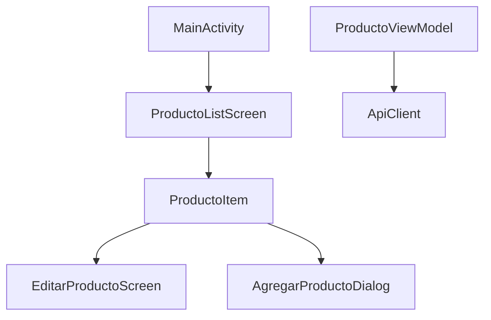

# Documentación del Proyecto: API Gestión de Productos

## Descripción del Proyecto
Este proyecto consiste en una API REST desarrollada con Spring Boot y una aplicación móvil en Android con Jetpack Compose, que trabajan juntas para gestionar un catálogo de productos.

## Backend (Spring Boot + MySQL)
El backend se encarga de almacenar y gestionar los productos en una base de datos MySQL. Proporciona una API REST que permite:
- Obtener productos (GET /api/productos)
- Agregar nuevos productos (POST /api/productos)
- Actualizar productos (PUT /api/productos/{id})
- Eliminar productos (DELETE /api/productos/{id})

El backend está desarrollado en Java con Spring Boot, usa Spring Data JPA para la persistencia y está gestionado con Maven.
Los productos se almacenan en una base de datos relacional y se pueden gestionar a través de endpoints HTTP en Postman o en la aplicacion Android.

# Aplicación Android (Jetpack Compose + Ktor)
La aplicación móvil permite a los usuarios interactuar con la API de Spring Boot para visualizar y gestionar productos.

- Lista los productos obtenidos de la API
- Permite agregar productos
- Usa Ktor Client para la comunicación HTTP
- Diseño basado en Jetpack Compose

Cuando abres la app, esta consulta los productos almacenados en el backend y los muestra en pantalla. Si agregas un nuevo producto, la app lo envía a la API y se actualiza la lista.

# Objetivo del Proyecto
- Demostrar la integración entre un backend en Spring Boot y una app móvil en Android.
- Aplicar conceptos de arquitectura cliente-servidor.
- Desarrollar una API REST y consumirla desde una app.
- Implementar una interfaz moderna con Jetpack Compose.

## Tecnologías Utilizadas
- **Java 22**
- **Spring Boot 3.2.2**
- **Spring Data JPA**
- **MySQL**
- **Postman**
- **Kotlin**
---

# pasos realizados en el proyecto

## Creacion y modificacion del proyecto Sprint boot (Explicacion del codigo)

El primer de los pasos es acceder a la siguiente web: https://start.spring.io/ 

Una vez ahi seleccionamos un proyecto con las siguientes caracteristicas:

- **Maven**
- **Sprint boot 3.4.3**
- **Packing de tipo Jar**
- **Version de java 17**

Tambien se deberan agregar las siguientes dependencias al proyecto

- **Spring Web (para el controlador REST)**
- **Spring Data JPA (para la persistencia)**
- **Driver de base de datos (MySQL, PostgreSQL, etc.)**
---
Una vez realizado la configuracion basica del proyecto debemos cumplir unos requisitos para que la aplicacion funcione.

- **Instalar maven y declararlo como variable de entorno**

Seleccionar la version Binary zip archive
https://maven.apache.org/download.cgi

- **Instalar PostMan**

Descargarlo y registrarse https://www.postman.com/downloads/

---
Una vez realizados los requisitos anteriores debemos modificar el archivo **application.propierties** con lo siguiente:
```sh
spring.application.name=gestion-productos
spring.datasource.url=jdbc:mysql://localhost:3306/productosdb
spring.datasource.username=root
spring.datasource.password=12345
spring.datasource.driver-class-name=com.mysql.cj.jdbc.Driver
spring.jpa.database-platform=org.hibernate.dialect.MySQL8Dialect
spring.jpa.hibernate.ddl-auto=update
spring.jpa.show-sql=true
```

Donde primero se le da el nombre del proyecto para verlo en los logs

le daremos la url de la base de datos relacional en este caso utilizamos una base de datos relacional MySql

Le daremos el usuario y la contraseña de la base de datos

Se necesitara el driver de jdbc para MySql para la conexion

Configura Hibernate para que utilice el dialecto de MySQL 8 en las consultas SQL generadas automáticamente

Controla como hibernate maneja la creacion y actualizacion de tablas. Con updte se actualiza la base de datos sin eliminar datos

show-sql=true nos permite ver todas las consultas por consola

---

# Pom.xml

ahora debemos agregar las siguientes dependencias al Pom.xml

- **Dependecian Sprint boot web**
```sh
<dependency>
    <groupId>org.springframework.boot</groupId>
    <artifactId>spring-boot-starter-web</artifactId>
</dependency>
```
Añade soporte para crear una ApiRest con sprint boot

- **Dependecian Sprint boot JPA**
```sh
<dependency>
    <groupId>org.springframework.boot</groupId>
    <artifactId>spring-boot-starter-data-jpa</artifactId>
</dependency>
```

Permite trabajar con bases de datos mediante Hibernate y JPA.

- **Validación de Datos**
```sh
<dependency>
    <groupId>org.springframework.boot</groupId>
    <artifactId>spring-boot-starter-validation</artifactId>
</dependency>
```
Habilita validaciones en las entidades usando anotaciones como @NotNull, @Size, etc.

- **Conector MySql**
```sh
<dependency>
    <groupId>com.mysql</groupId>
    <artifactId>mysql-connector-j</artifactId>
    <scope>runtime</scope>
</dependency>
```
Es el driver JDBC que permite la conexión con MySQL.

---
## Estructura de Clases y Relación entre Componentes

### 1. **Clase `DemoApplication`**
- Es la clase principal de la aplicación.
- Contiene el método `main()`, que inicia la aplicación Spring Boot utilizando `SpringApplication.run(DemoApplication.class, args);`.
- Su función es inicializar el contexto de Spring y cargar todos los componentes.

```sh
@SpringBootApplication
public class DemoApplication {
    public static void main(String[] args) {
        SpringApplication.run(DemoApplication.class, args);
    }
}
```

### 2. **Clase `Producto`** (Entidad)
- Representa la tabla `productos` en la base de datos.
- Usa la anotación `@Entity` para que Spring Data JPA la reconozca como una entidad.
- Contiene los atributos del producto: `id`, `nombre`, `precio` y `fechaCreacion`.
- `@Id` y `@GeneratedValue(strategy = GenerationType.IDENTITY)` garantizan que el `id` se genere automáticamente.
- `@NotBlank` y `@NotNull` validan que los campos no sean nulos o vacíos.
- `@PrePersist` asigna automáticamente la fecha de creación cuando se guarda un nuevo producto.

```sh
@Entity
@Table(name = "productos")
public class Producto {
	@Id
    @GeneratedValue(strategy = GenerationType.IDENTITY)
    private int id;

    @NotBlank(message = "El nombre no puede estar vacío")
    private String nombre;

    @NotNull(message = "El precio es obligatorio")
    @Positive(message = "El precio debe ser mayor que 0")
    private Double precio;

    @Column(name = "fecha_creacion", updatable = false)
    private LocalDateTime fechaCreacion;

    @PrePersist
    protected void onCreate() {
        this.fechaCreacion = LocalDateTime.now();
    }
```

### 3. **Interfaz `ProductoRepository`** (Capa de Acceso a Datos)
- Extiende `JpaRepository<Producto, Integer>`, lo que permite realizar operaciones CRUD sin necesidad de escribir código SQL.
- Proporciona métodos como `findAll()`, `findById()`, `save()`, `deleteById()`, etc.
- Es utilizada por `ProductoService` para interactuar con la base de datos.

```sh
public interface ProductoRepository extends JpaRepository<Producto, Integer> {
}
```

### 4. **Clase `ProductoService`** (Capa de Servicio)
- Contiene la lógica de negocio relacionada con los productos.
- Utiliza `ProductoRepository` para acceder a la base de datos.
- Métodos principales:
  - `listarProductos()`: Obtiene todos los productos.
  - `obtenerProductoPorId(id)`: Busca un producto por ID, lanza `404` si no existe.
  - `agregarProducto(producto)`: Guarda un nuevo producto.
  - `eliminarProducto(id)`: Elimina un producto si existe.
  - `actualizarProducto(id, producto)`: Modifica los atributos de un producto existente.
- Usa `ResponseStatusException(HttpStatus.NOT_FOUND, "Producto no encontrado")` para manejar errores de productos inexistentes.

```sh
@Service
public class ProductoService {

    private final ProductoRepository productoRepository;
    public ProductoService(ProductoRepository productoRepository) {
        this.productoRepository = productoRepository;
    }

        public List<Producto> listarProductos() {
        return productoRepository.findAll();
    }

        public Producto obtenerProductoPorId(int id) {
        return productoRepository.findById(id)
                .orElseThrow(() -> new ResponseStatusException(HttpStatus.NOT_FOUND, "Producto no encontrado"));
    }

        public Producto agregarProducto(Producto producto) {
        return productoRepository.save(producto);
    }

    public void eliminarProducto(int id) {
        if (!productoRepository.existsById(id)) {
            throw new ResponseStatusException(HttpStatus.NOT_FOUND, "Producto no encontrado");
        }
        productoRepository.deleteById(id);
    }

        public Producto actualizarProducto(int id, Producto producto) {
        return productoRepository.findById(id).map(p -> {
            p.setNombre(producto.getNombre());
            p.setPrecio(producto.getPrecio());
            return productoRepository.save(p);
        }).orElse(null);
    }

```

### 5. **Clase `ProductoController`** (Controlador REST)
- Expone los endpoints de la API para interactuar con los productos.
- Anotado con `@RestController` y `@RequestMapping("/api/productos")`.
- Métodos principales:
  - `GET /api/productos` → Llama a `listarProductos()`.
  - `GET /api/productos/{id}` → Llama a `obtenerProductoPorId(id)`, devuelve `404` si no existe.
  - `POST /api/productos` → Agrega un nuevo producto con validación `@Valid`.
  - `PUT /api/productos/{id}` → Modifica un producto existente.
  - `DELETE /api/productos/{id}` → Elimina un producto, devuelve `404` si no existe.
- Usa `ResponseEntity<T>` para manejar las respuestas HTTP con sus respectivos códigos de estado.

```sh
@RequestMapping("/api/productos")
public class ProductoController {

    @Autowired
    private ProductoService productoService;

        @GetMapping
    public List<Producto> listarProductos() {
        return productoService.listarProductos();
    }

 @GetMapping("/{id}")
    public ResponseEntity<Producto> obtenerProducto(@PathVariable int id) {
        try {
            Producto producto = productoService.obtenerProductoPorId(id);
            return ResponseEntity.ok(producto);
        } catch (ResponseStatusException e) {
            return ResponseEntity.status(HttpStatus.NOT_FOUND).build();
        }
    }

        public ResponseEntity<?> agregarProducto(@Valid @RequestBody Producto producto) {
        return ResponseEntity.ok(productoService.agregarProducto(producto));
    }

        @DeleteMapping("/{id}")
    public ResponseEntity<String> eliminarProducto(@PathVariable int id) {
        try {
            productoService.eliminarProducto(id);
            return ResponseEntity.ok("Producto eliminado correctamente");
        } catch (ResponseStatusException e) {
            return ResponseEntity.status(HttpStatus.NOT_FOUND).body("Producto no encontrado");
        }
    }
    @PutMapping("/{id}")
        public ResponseEntity<?> actualizarProducto(@PathVariable int id, @Valid @RequestBody Producto producto) {
    	Producto actualizado = productoService.actualizarProducto(id, producto);
        if (actualizado != null) {
            return ResponseEntity.ok(actualizado);
        } else {
            return ResponseEntity.notFound().build();
        }
    }
}

```

### 6. **Relación entre las Clases**
- `ProductoController` se comunica con `ProductoService` para ejecutar las operaciones de negocio.
- `ProductoService` usa `ProductoRepository` para interactuar con la base de datos.
- `ProductoRepository` realiza las consultas SQL a la base de datos mediante JPA.
- `Producto` es la entidad que representa los datos almacenados en la base de datos.

---

# Documentación de la Aplicación Android (Kotlin)

## 1. Producto (Modelo de datos)

Esta clase representa un producto dentro de la aplicación. Se usa para manejar los datos de los productos obtenidos de la API REST.

Atributos principales:

id: Identificador único del producto.

nombre: Nombre del producto.

precio: Precio del producto.
```
@Serializable
data class Producto(
    val id: Int? = null,
    val nombre: String,
    val precio: Double
)
```
## 2. ApiClient (Cliente HTTP con Ktor)
Esta clase maneja la comunicación con la API REST usando **Ktor Client**. Se encarga de realizar las peticiones HTTP necesarias para obtener, agregar, actualizar y eliminar productos.

### Funcionalidades principales:
- **getProductos()**: Obtiene la lista de productos desde la API.
- **addProducto()**: Envía un nuevo producto a la API.
- **deleteProducto()**: Elimina un producto por su ID.
- **updateProducto()**: Modifica un producto existente en la API.

```kotlin
object ApiClient {
    private val client = HttpClient {
        install(ContentNegotiation) {
            json(Json { ignoreUnknownKeys = true })
        }
        install(HttpTimeout) {
            requestTimeoutMillis = 30000
            connectTimeoutMillis = 10000
        }
    }

    suspend fun getProductos(): List<Producto> {
        return client.get("http://192.168.1.130:8080/api/productos").body()
    }

    suspend fun addProducto(producto: Producto) {
        client.post("http://192.168.1.130:8080/api/productos") {
            contentType(ContentType.Application.Json)
            setBody(producto)
        }
    }

    suspend fun deleteProducto(id: Int) {
        client.delete("http://192.168.1.130:8080/api/productos/$id")
    }

    suspend fun updateProducto(producto: Producto) {
        client.put("http://192.168.1.130:8080/api/productos/${producto.id}") {
            contentType(ContentType.Application.Json)
            setBody(producto)
        }
    }
}
```

## 3. ProductoViewModel (Gestión de Estado con StateFlow)
Esta clase actúa como intermediaria entre la **UI** y `ApiClient`. Se encarga de gestionar los productos y manejar los cambios de estado.

### Funcionalidades principales:
- **cargarProductos()**: Obtiene la lista de productos desde la API y la almacena en un `StateFlow` para que la UI se actualice automáticamente.
- **Manejo de errores y estado de carga**: Controla si hay errores y si se están cargando datos.

```kotlin
class ProductoViewModel : ViewModel() {
    private val _productos = MutableStateFlow<List<Producto>>(emptyList())
    val productos: StateFlow<List<Producto>> = _productos

    private val _error = MutableStateFlow<String?>(null)
    val error: StateFlow<String?> = _error

    private val _isLoading = MutableStateFlow(false)
    val isLoading: StateFlow<Boolean> = _isLoading

    init { cargarProductos() }

    fun cargarProductos() {
        viewModelScope.launch {
            _isLoading.value = true
            try {
                _productos.value = ApiClient.getProductos()
            } catch (e: Exception) {
                _error.value = "Error al cargar productos: ${e.message}"
            } finally {
                _isLoading.value = false
            }
        }
    }
}
```

## 4. MainActivity (Pantalla Principal con Scaffold)
Esta clase define la estructura principal de la aplicación y muestra la lista de productos en la pantalla.

### Funcionalidades principales:
- Contiene un `Scaffold` que estructura la UI.
- Muestra la lista de productos usando `ProductoListScreen`.
- Usa un `FloatingActionButton` para agregar productos.

```kotlin
class MainActivity : ComponentActivity() {
    override fun onCreate(savedInstanceState: Bundle?) {
        super.onCreate(savedInstanceState)
        setContent {
            val viewModel: ProductoViewModel = viewModel()
            var mostrarDialogo by remember { mutableStateOf(false) }

            Scaffold(
                floatingActionButton = {
                    FloatingActionButton(onClick = { mostrarDialogo = true }) {
                        Icon(Icons.Default.Add, contentDescription = "Agregar Producto")
                    }
                },
                content = { padding ->
                    ProductoListScreen(modifier = Modifier.padding(padding), viewModel = viewModel)
                }
            )
        }
    }
}
```

## 5. ProductoListScreen (Lista de Productos con LazyColumn)
Este componente muestra la lista de productos en la UI de manera eficiente usando `LazyColumn`.

### Funcionalidades principales:
- Obtiene los productos desde `ProductoViewModel`.
- Los muestra en una lista de tarjetas (`ProductoItem`).

```kotlin
@Composable
fun ProductoListScreen(viewModel: ProductoViewModel) {
    val productos by viewModel.productos.collectAsState()
    Column(modifier = Modifier.padding(16.dp)) {
        LazyColumn {
            items(productos) { producto ->
                ProductoItem(producto, viewModel)
            }
        }
    }
}
```

## 6. EditarProductoScreen (Pantalla para Editar Producto)

Permite modificar los datos de un producto existente y enviarlos a la API.

Funcionalidades principales:

Permite editar el nombre y precio de un producto.

Valida los datos antes de actualizar el producto en la API.
```
@Composable
fun EditarProductoScreen(
    producto: Producto,
    viewModel: ProductoViewModel,
    onProductoActualizado: () -> Unit
) {
    var nombre by remember { mutableStateOf(producto.nombre) }
    var precio by remember { mutableStateOf(producto.precio.toString()) }
    var mensajeError by remember { mutableStateOf<String?>(null) }

    Column(modifier = Modifier.padding(16.dp)) {
        Text("Editar Producto", style = MaterialTheme.typography.headlineMedium)

        OutlinedTextField(
            value = nombre,
            onValueChange = { nombre = it },
            label = { Text("Nombre del Producto") },
            modifier = Modifier.fillMaxWidth()
        )

        OutlinedTextField(
            value = precio,
            onValueChange = { precio = it },
            label = { Text("Precio") },
            modifier = Modifier.fillMaxWidth()
        )

        if (mensajeError != null) {
            Text(text = mensajeError!!, color = MaterialTheme.colorScheme.error)
        }

        Button(
            onClick = {
                val precioDouble = precio.toDoubleOrNull()
                if (nombre.isBlank() || precioDouble == null || precioDouble <= 0) {
                    mensajeError = "Nombre y precio válidos son obligatorios"
                } else {
                    val productoActualizado = producto.copy(nombre = nombre, precio = precioDouble)
                    viewModel.updateProducto(productoActualizado)
                    onProductoActualizado()
                }
            }
        ) {
            Text("Guardar Cambios")
        }
    }
}
```

## Relación entre las Clases
- `MainActivity` es el punto de entrada y muestra `ProductoListScreen`.
- `ProductoListScreen` obtiene los productos desde `ProductoViewModel`.
- `ProductoViewModel` usa `ApiClient` para comunicarse con la API.
- `ProductoItem` representa cada producto individual y permite editar o eliminar.



# Instrucciones de Ejecución

## Descargar los Proyectos
Para comenzar, descarga los archivos desde **GitHub** accediendo al siguiente enlace:

 **Repositorio:** [ApiRest_SprintBoot_Android](https://github.com/Ismarmz/ApiRest_SprintBoot_Android)

Una vez descargado, deberías tener las siguientes carpetas:

- **gestion-productos** (Proyecto Maven - Backend)
- **ApiRestAAD** (Aplicación Android)

---

## Ejecución de la API REST
### Verificar el puerto **8080**
Antes de ejecutar la API, asegurémonos de que el puerto **8080** esté libre. Abre **CMD** y ejecuta:
```sh
netstat -ano | findstr :8080
```
Si **no devuelve nada**, significa que el puerto está disponible.
Si está en uso, finaliza el proceso con:
```sh
taskkill /PID 2912 /F
```
(Sustituye **2912** por el número de proceso que aparezca en tu terminal).

### Ejecutar Maven
1. Abre el archivo **pom.xml** en `gestion-productos`.
2. Clic derecho → **Run As** → **Maven Build**.
3. En "Goals" escribe:
   ```sh
   clean install
   ```
4. Si no hay errores, ejecuta la clase **`DemoApplication`** para iniciar la API REST.

---

## Configuración de la Base de Datos
Es necesario tener una base de datos en **MySQL** previamente creada. Ejecuta las siguientes **queries** en tu gestor de base de datos:
```sql
CREATE DATABASE productosDB;
USE productosDB;

CREATE TABLE productos (
    id INT AUTO_INCREMENT PRIMARY KEY,
    nombre VARCHAR(255) NOT NULL,
    precio DECIMAL(10,2) NOT NULL,
    fecha_creacion TIMESTAMP DEFAULT CURRENT_TIMESTAMP
);

INSERT INTO productos (nombre, precio) VALUES ('Laptop HP', 1200.50);
INSERT INTO productos (nombre, precio) VALUES ('Smartphone Samsung', 899.99);
INSERT INTO productos (nombre, precio) VALUES ('Teclado Mecánico', 150.75);
INSERT INTO productos (nombre, precio) VALUES ('Monitor LG 24"', 250.00);
INSERT INTO productos (nombre, precio) VALUES ('Mouse Gamer', 80.99);
```

---

## Probar la API REST en Postman
Para comprobar que la API funciona correctamente, abre **Postman** y realiza las siguientes peticiones:

###  **Obtener un producto**
**Método:** `GET`  
 **URL:** `http://localhost:8080/api/productos/1`

###  **Agregar un nuevo producto**
**Método:** `POST`  
 **URL:** `http://localhost:8080/api/productos`
```json
{
  "nombre": "Manzana",
  "precio": 1.00
}
```

###  **Actualizar un producto**
**Método:** `PUT`  
**URL:** `http://localhost:8080/api/productos/1`
```json
{
  "nombre": "Laptop HP Pro",
  "precio": 1300.00
}
```

### **Eliminar un producto**
**Método:** `DELETE`  
**URL:** `http://localhost:8080/api/productos/1`

### **Errores esperados**
| Método | URL | Código de error |
|--------|-----|----------------|
| `GET` | `/api/productos/999` | `404 Not Found` (Producto no existe) |
| `PUT` | `/api/productos/999` | `404 Not Found` (Producto no existe) |
| `DELETE` | `/api/productos/999` | `404 Not Found` (Producto no existe) |
| `POST` | `/api/productos` con datos inválidos | `400 Bad Request` |

Si estas peticiones funcionan correctamente, significa que la **API REST está operativa**.

---

## Configuración de la Aplicación Android
Para ejecutar la aplicación **ApiRestAAD** en **Android Studio**:

### **Requisitos**
Tener instalado **Android Studio (Ladybug)** y el **SDK 35**.  
Verificar que la API REST esté corriendo en **http://localhost:8080**.

###  **Configurar la IP en `ApiClient`**
**Si usas un emulador de Android:**  
Abre `ApiClient.kt` y usa:
```kotlin
"http://10.0.2.2:8080/api/productos"
```
**Si usas un dispositivo físico (USB/WiFi):**  
Ejecuta en **CMD** para obtener la IP de tu PC:
```sh
ipconfig
```
Busca **IPv4**, que tendrá un formato similar a `192.168.x.xxx`, y reemplázala en `ApiClient.kt`:
```kotlin
"http://192.168.31.121:8080/api/productos"
```
(Reemplaza `192.168.31.121` por tu IP real).

### **Ejecutar la aplicación**
1. Abre `ApiRestAAD` en **Android Studio**.
2. Asegúrate de que la API esté corriendo.
3. **Ejecuta la aplicación** en un emulador o dispositivo físico.
4. **Realiza las peticiones** desde la app y verifica que funcionan.

---

Con estos pasos, la aplicación y la API estarán correctamente configuradas y listas para su uso.


